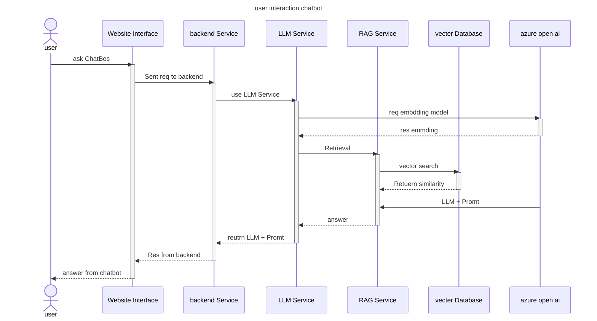
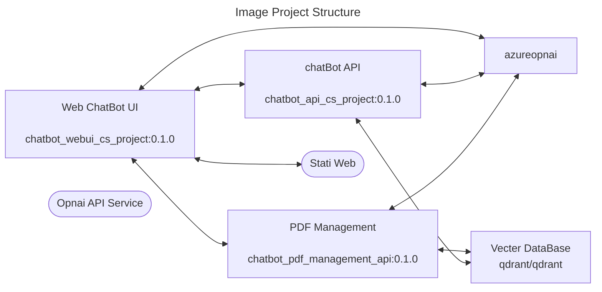

# Chatbot Intergration with OpenAI LLM and WebUI

## Overview 🔎
This project showcases the development of an AI chatbot assistant Final Project  with computer Science at RMTUL
using large language models (LLMs) and the <b>LangChain framework</b>. 
The chatbot integrates the <b> OpenAI API (model gpt-4o-mini)</b> or Local LLM model with (Ollama) eng  Llama  and utilizes the <b>
RAG (Retrieval Augmented Generation)</b> method to produce concise summaries from the <b>Vector database (Qdrant)</b>. 
A user-friendly web (WebUI) interface is also included for seamless interaction with the model.


## 🔑Key Features
- A user-friendly **Web Interface** for interacting with the chatbot
- A **Backend API** built with FastAPI and Swagger for executing human commands
- A **Document Management System** for processing and indexing documents
- A user interface for viewing and managing the **Vector Database** using Qdrant

## 🛒Prerequisites  
- Python 3 
- LLM model
  - OpenAI API
  - Ollama (run LLM on local machine)
- Langchain
- FastAPI
- Node.js
- Vite
- React TypeScript
- Docker Engine
- Docker Compose

## Step 1: ⬇ Clone the Repository  
-  source  code  on  [ Github](https://github.com/JeerasakAnanta/cs_project)  you can clone  with `https` or `ssh`
  - clone with https
  ```bash 
    git clone https://github.com/JeerasakAnanta/cs_project

    cd cs_project
  ```
  - clone with ssh
  ```sh
    git clone git@github.com:JeerasakAnanta/cs_project.git
    
    cd  cs_project
  ```
## Step 2: 🎈 Create Virtual Environments
  use  `venv` (2.1) or `poetry` (2.2) 

  ### 2.1 creat virtual environments 
  - 2.1.1 create with  venv (linux)
    ```bash 
    python3 -m venv envchatbot
    ```

  - 2.1.2 activate environment (linux)

    ```bash
    source envchatbot/bin/activate  
    ```
  2.1.3 create create with  venv (window) 
    ```
    python -m venv envchatbot
    ```
 - 2.1.3activate environment (window)

    ```bash
    .\envchatbot\Scripts\activate.bat
    ```
  ### 2.2 Poetry is a tool for dependency management and packaging
  - 2.2.1 install  Poetry with pip
    ```bash 
    pip install poetry
    ```
  - 2.2.2 install  dependency with poetry 
    ```bash
    poetry install 
    ```
  - 2.2.3 update  dependency  
    ```bash
    poetry update
    ```
  - 2.2.4 use poetry  shell 
    ```bash
    poetry  shell
    ```

## Step 3: 🛠 Install  Dependencies with venv
- 3.1 update  pip   24.0 -> 24.2

  ```bash
  python3 -m pip install --upgrade pip
  ```

- 3.2 install  requirements

  ```bash
    pip install  -r requirements.txt
  ```

## Step 4: ⚙ Configurethe `.env`
- 4.1 copy example `.env.example`  to `.env`  for API 
  ```bash
    cp .env.example .env
  ```
- 4.2 copy  example `.env.example`  to `chatbot_web/.env` for web site
  ```bash 
    cp .env.example chatbot_web/.env
  ```
- example  environment file `.env`
  ```
  # .env
  
  ```
## Step 5 : 🗂 Create vecter DB with qdrant

- 5.1 create vecter DB with qdrant with   `docker-compose.yml`
  ```yaml
  services:
    # Qdrant service
    qdrant:
      image: qdrant/qdrant:latest
      restart: always
      container_name: qdrant_vectorDB
      ports:
        - 6333:6333
        - 6334:6334
      expose:
        - 6333
        - 6334
        - 6335
      configs:
        - source: qdrant_config
          target: /qdrant/config/production.yaml
      volumes:
        - ./qdrant_data:/qdrant/storage
  configs:
    qdrant_config:
      content: "log_level: INFO"
  ```
- 5.2 start qdrant  with compose 
  ```sh
  docker compose up -d 
  ```
- 5.3 check qdrant 
  ```sh 
    docker ps -a 
  ``` 
- 5.4 cd `chatbot_pdf_management_api` 
- 5.5 create folder `pdfs`
- 5.6 upload file .pdf to `pdfs`  
- 5.7 create collection qdrant with python use command run scrtip 
  `/chatbot_pdf_management_api/create_vecter_db.py`
    
  ```sh
  python3 create_vecter_db.py
  ```
## Step 6: Runing  Development 

- `web Chatbot UI`: /chatbot_web/
  - ```bash
    npm run dev 
    ```
- `Chatbot API`:
  - ```bash    
    uvicorn chatbot_api:app --host 0.0.0.0 --port 8003 --reload
    ```
- `Chatbot PDF management`:
  - ```bash
    uvicorn pdf_management_api:app --host 0.0.0.0 --port 8004 --reload
    ```

## Step 6: Runing with docker  &  run docker comopse 

- สร้าง  docker container  โดยการใช้งาน Script ในการ built 

  ```bash
  chmod +x  run_build_image.sh 
  ./run_build_image.sh
  ```
## web URL access port
- WebChatbotUI: http://localhost:8002
- Chat API: http://localhost:8003
- ระบบจัดการ PDF: http://localhost:8004
- Qdrant VecterDB: http://localhost:6333
- Statict Web: http://eden205.kube.baac.or.th:8085/
 
## 🧪 Example Fine-tuning (RAG Chat Bot) 🚀
### fine-tuning with System  promte
  - file `chatbot_api/chatbot_api.py`
  - `{context}` : ข้อความที่ค้น หาได้จาก Vecter DB  
  - `{question}`: ข้อความที่ ถาม Chatbot 
  - 
  - ```python 
    prompt = PromptTemplate(
          input_variables=["context", "question"],
          template="""
              you are a helpful assistant. please answer the question based on the context below.
          {context}
          original: {question}
          """,
      )
    ```
### fine-tuning  LLM model 
  - exapmel with  openai 
  - ```python
     llm=ChatOpenAI(
            azure_deployment="gpt-4o-mini",
            api_version="2023-06-01-preview",
            temperature=0.2,
            max_tokens=5000,
            timeout=None,
            max_retries=2,
        )
    ```
  - API Ref : [OpenAI](https://platform.openai.com/docs/api-reference/introduction) 

### fune-tuning RAG 

  - file `chatbot_api/chatbot_api.py`
  - `search_type` : similarity 
  - `return_sourece_document` :คืนค่าเอกสาร
  - ```python
    return ConversationalRetrievalChain.from_llm(
        llm=ChatOpenAI(...),
        retriever=qdrant_store.as_retriever(
            search_type="similarity", search_kwargs={"k": 6, "score_threshold": 0.4}
        ),
        combine_docs_chain_kwargs={"prompt": prompt},
        return_source_documents=True,
    )
    ```
  - API Ref: [ConversationalRetrievalChain](https://python.langchain.com/api_reference/langchain/chains/langchain.chains.conversational_retrieval.base.ConversationalRetrievalChain.html)

## 🆕 Feature

### 🌐 Web ChatBot 
  - `/` หน้าหลักในการถามตอบ chatbot   
  - `/pdflist` เเสดง รายการเอกสารที่ ChatBot สามารถตอบได้ทั้งหมด 
  - `/management` ระบบการจัดการ เอกสาร PDF
  - `/upload`  เอกสารเก็บไว้ในเเล้วทำให้ เป็น vecter DB  
  - `/list` รายการเอกสารที่ chatbot สามารถตอบได้ทั้งหมด 
  - `/about` เกี่ยวกับสั้นๆ chatbot  

### 🚧 API Endpoint 

#### 🔗 Chatbot API
- `/api/` : Root  
- `/api/chat` : Chatbot 
- `/api/history` : list of hisotry chatbot   
- `/api/clear-history` : clear chat hisotry

#### 📚 Chatbot PDF management API  
- `/`  :Root 
- `/upload` :  update file  
- `/delete/{filename}`
- `/files` : files pdf 
- `/pdflist` : list of pdf 
- `/reembedding` : re-embeddings
  
---
## 🚩 Sequence diagram 


## 🏗 Project Structure


## ✈ Version 

### 🕸 WebGUI
- 0.1.0 initial project web UI

   
### 🔗 ChatBot_API
- 0.10 initial project chatbot API

### 📑 PDF_API
- 0.1.0 initial project pdf management API 

## 👷‍♂️ Development 
- Start project on  1 December 2024 to  2025
- Jeerasak Ananta  (Super AI Engineer Season 4 & SC Student RMUTL) [email](jeerasakananta@gmail.com) 

## 🔃 Reference
- [[1] LangChain ](https://www.langchain.com/) 
- [[2] Azure OpenAI Service ](https://azure.microsoft.com/en-us/products/ai-services/openai-service?msockid=33e8fe8e304e6add0fb4ea7b31346b54)
- [[3] High-Performance Vector Search at Scale (Qdrant)
 ](https://qdrant.tech/)
- [[4] RAG (Retrieval-Augmented Generation)](https://aws.amazon.com/what-is/retrieval-augmented-generation/)
- [[5] Uvicorn](https://www.starlette.io/uvicorn/)
- [[6] FastAPI](https://fastapi.tiangolo.com/)
- [[7] Prompt Engineering Guide
](https://www.promptingguide.ai/)

- [[8] Docker engine and docker compose](https://www.docker.com/)

## 😊 License
This project, Prototype One, is licensed under the terms of the MIT license, created for educational purposes at Rajamangala University of Technology Lanna (RMUTL) in the Computer Science program.
