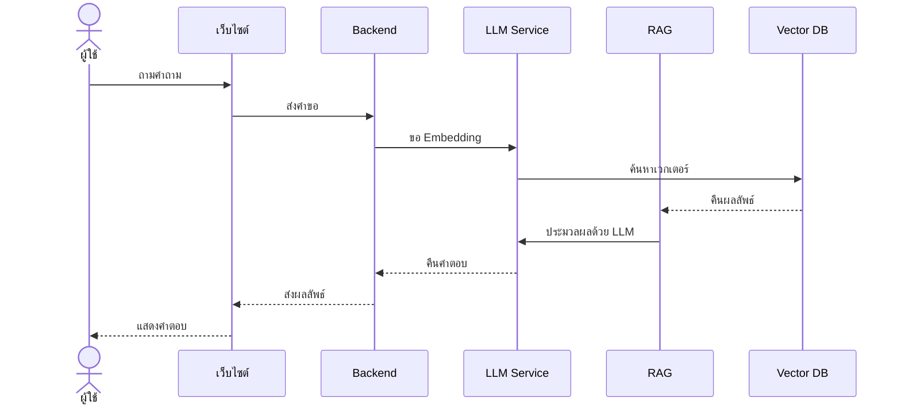

# LannaFinChat
## ระบบแชตบอตถามตอบจากเอกสารด้วยเทคนิค RAG และ LLM

---

## 📋 ภาพรวมโครงการ

**LannaFinChat** เป็นระบบแชตบอตอัจฉริยะที่ผสมผสานเทคโนโลยี Retrieval-Augmented Generation (RAG) และ Large Language Models (LLM) เพื่อให้ผู้ใช้สามารถสอบถามข้อมูลจากเอกสาร PDF ได้อย่างมีประสิทธิภาพ โครงการนี้พัฒนาขึ้นเป็นส่วนหนึ่งของงานสำเร็จการศึกษาระดับปริญญาตรี สาขาวิทยาการคอมพิวเตอร์ มหาวิทยาลัยเทคโนโลยีราชมงคลล้านนา (RMUTL)

### วัตถุประสงค์หลัก
- พัฒนาระบบแชตบอตที่สามารถประมวลผลและตอบคำถามจากเอกสาร PDF อย่างแม่นยำ
- ประยุกต์ใช้เทคนิค RAG เพื่อเพิ่มความเชื่อถือได้ในการค้นหาและสรุปข้อมูล
- สร้างอินเทอร์เฟซผู้ใช้ที่ใช้งานง่ายและตอบสนองต่อการใช้งาน
- ให้บริการผ่าน REST API ที่มีความสามารถในการขยายและบำรุงรักษาได้ง่าย

---

## ✨ คุณสมบัติหลัก

- **อินเทอร์เฟซผู้ใช้ (UI)** - ส่วนติดต่อกับผู้ใช้ที่เป็นมิตรและใช้งานง่าย
- **ระบบ API** - พัฒนาด้วย FastAPI พร้อม API documentation ผ่าน Swagger
- **การจัดการเอกสาร** - ระบบอัปโหลด ประมวลผล และสร้างดัชนีเอกสาร PDF โดยอัตโนมัติ
- **ฐานข้อมูลเวกเตอร์** - ใช้ Qdrant สำหรับจัดเก็บและค้นหาข้อมูลแบบเวกเตอร์
- **การตรวจสอบสิทธิ์** - ระบบ JWT Token สำหรับความปลอดภัย
- **การจัดการผู้ใช้** - ระบบลงทะเบียน เข้าสู่ระบบ และจัดการโปรไฟล์
- **ประวัติการสนทนา** - เก็บข้อมูลประวัติการสนทนาเพื่อความสะดวก
- **Docker Support** - รองรับการปรับใช้ผ่าน Docker Compose

---

## 🆕 อัปเดตเวอร์ชันล่าสุด

- ✅ ปรับปรุงระบบ Authentication ด้วย JWT Token
- ✅ เพิ่มระบบ User Management (ลงทะเบียน/เข้าสู่ระบบ)
- ✅ เพิ่มระบบจัดการประวัติการสนทนา (Chat History)
- ✅ ปรับปรุงสถาปัตยกรรมโครงการด้วย FastAPI
- ✅ เพิ่ม Alembic Database Migrations
- ✅ รองรับการปรับใช้ผ่าน Docker Compose

---

## 🔧 สถาปัตยกรรมระบบ

### โครงสร้างโครงการ

```
LannaFinChat/
├── frontend/                           # ส่วน User Interface
│   ├── src/
│   ├── package.json
│   └── vite.config.ts
├── chat_api/                          # ระบบ API หลัก
│   ├── main.py
│   ├── requirements.txt
│   └── app/
├── pdf_management_api/                # API สำหรับจัดการ PDF
│   ├── main.py
│   └── create_vector_db.py
├── docker-compose.yml
└── README.md
```

### เทคโนโลยีที่ใช้

**Backend:**
- Python 3.12.3
- FastAPI & Uvicorn
- SQLAlchemy (ORM)
- Pydantic (Validation)
- LangChain (RAG Framework)
- OpenAI API (GPT-4o-mini)
- Qdrant (Vector Database)

**Frontend:**
- React 18 + TypeScript
- Vite (Build Tool)
- Tailwind CSS
- Material-UI (MUI)
- Axios (HTTP Client)

**DevOps:**
- Docker & Docker Compose
- Alembic (Database Migrations)

---

## 📋 ความต้องการเบื้องต้น

### ซอฟต์แวร์ที่จำเป็น

| ระบบ | เวอร์ชัน | ลิงค์ |
|------|---------|------|
| Python | 3.12.3+ | [python.org](https://www.python.org/downloads) |
| Node.js | 16+ | [nodejs.org](https://nodejs.org/en) |
| Docker | Latest | [docker.com](https://www.docker.com/) |
| Docker Compose | Latest | [docs.docker.com/compose](https://docs.docker.com/compose/) |

### บริการภายนอก

- **OpenAI API Key** - สำหรับใช้บริการ GPT-4o-mini
- **Qdrant Instance** - สำหรับจัดเก็บเวกเตอร์ (รองรับ Docker Compose)

---

## 🚀 การติดตั้งและเรียกใช้

### ขั้นตอนที่ 1: โคลนโครงการ

```bash
git clone https://github.com/JeerasakAnanta/cs_project
cd cs_project
```

### ขั้นตอนที่ 2: สร้าง Virtual Environment

ติดตั้ง `uv` (Python Package Manager):
```bash
# ดูรายละเอียดการติดตั้งที่ https://docs.astral.sh/uv/
curl -LsSf https://astral.sh/uv/install.sh | sh
```

สร้าง Virtual Environment:
```bash
uv venv
source .venv/bin/activate  # Linux/macOS
# หรือ
.venv\Scripts\activate     # Windows
```

### ขั้นตอนที่ 3: ติดตั้ง Dependencies

```bash
# Python dependencies
uv pip install -r chat_api/requirements.txt

# Node.js dependencies
cd frontend
npm install
cd ..
```

### ขั้นตอนที่ 4: ตั้งค่าไฟล์ Environment

```bash
# คัดลอกไฟล์ตัวอย่าง
cp .env.example .env
cp .env.example frontend/.env

# แก้ไขไฟล์ .env ด้วยค่าของคุณ
# - OpenAI API Key
# - Qdrant Host & Port
# - Database Connection String
```

### ขั้นตอนที่ 5: ตั้งค่าฐานข้อมูล

เริ่มระบบ Qdrant ผ่าน Docker Compose:

```bash
docker compose up -d
docker ps -a  # ตรวจสอบสถานะ Container
```

### ขั้นตอนที่ 6: สร้างฐานข้อมูลเวกเตอร์

```bash
# สร้างโฟลเดอร์สำหรับไฟล์ PDF
mkdir -p pdf_management_api/pdfs

# สร้าง Vector Database Collection
python3 pdf_management_api/create_vector_db.py
```

### ขั้นตอนที่ 7: เรียกใช้ระบบ

#### ตัวเลือก A: การรันแบบพัฒนา

เปิด Terminal หลายหน้าต่าง:

```bash
# Terminal 1: Frontend
cd frontend
npm run dev
```

```bash
# Terminal 2: Chat API
uvicorn chat_api.main:app --host 0.0.0.0 --port 8003 --reload
```

```bash
# Terminal 3: PDF Management API
uvicorn pdf_management_api.main:app --host 0.0.0.0 --port 8004 --reload
```

#### ตัวเลือก B: การรันแบบ Docker (แนะนำสำหรับ Production)

```bash
chmod +x run_build_image.sh
./run_build_image.sh
```

---

## 🌐 การเข้าถึงระบบ

หลังจากเรียกใช้ระบบ สามารถเข้าถึงได้ที่:

| บริการ | URL | คำอธิบาย |
|--------|-----|---------|
| Web UI | [http://localhost:8002](http://localhost:8002) | อินเทอร์เฟซผู้ใช้ |
| Chat API | [http://localhost:8003](http://localhost:8003) | Swagger API Docs |
| PDF Manager | [http://localhost:8004](http://localhost:8004) | API สำหรับจัดการ PDF |
| Qdrant | [http://localhost:6333](http://localhost:6333) | Dashboard เวกเตอร์ |

---

## 📚 API Endpoints

### Chatbot API

| Method | Endpoint | คำอธิบาย |
|--------|----------|---------|
| GET | `/api/` | ตรวจสอบสถานะ API |
| POST | `/api/chat` | ส่งคำถามไปยังแชตบอต |
| GET | `/api/history` | ดูประวัติการสนทนา |
| POST | `/api/clear-history` | ล้างประวัติการสนทนา |

### PDF Management API

| Method | Endpoint | คำอธิบาย |
|--------|----------|---------|
| GET | `/` | ตรวจสอบสถานะ |
| POST | `/upload` | อัปโหลดไฟล์ PDF |
| DELETE | `/delete/{filename}` | ลบไฟล์ PDF |
| GET | `/files` | แสดงรายการไฟล์ |
| GET | `/pdflist` | แสดงรายการ PDF ทั้งหมด |
| POST | `/reembedding` | สร้างเวกเตอร์ใหม่ |

---

## 🔄 ลำดับการทำงาน (Flow)


```mermaid
sequenceDiagram
  actor ผู้ใช้
  participant Website as เว็บไซต์
  participant Backend as Backend
  participant LLM as LLM Service
  participant RAG as RAG
  participant Vector as Vector DB

  ผู้ใช้->>Website: ถามคำถาม
  Website->>Backend: ส่งคำขอ
  Backend->>LLM: ขอ Embedding
  LLM->>Vector: ค้นหาเวกเตอร์
  Vector-->>RAG: คืนผลลัพธ์
  RAG->>LLM: ประมวลผลด้วย LLM
  LLM-->>Backend: คืนคำตอบ
  Backend-->>Website: ส่งผลลัพธ์
  Website-->>ผู้ใช้: แสดงคำตอบ
```

---

## ⚙️ การปรับแต่งเพิ่มเติม

### ปรับแต่ง System Prompt

```python
from langchain.prompts import PromptTemplate

prompt = PromptTemplate(
    input_variables=["context", "question"],
    template="""
    คุณเป็นผู้ช่วยอัจฉริยะ กรุณาตอบคำถามตามบริบทด้านล่าง

    บริบท: {context}

    คำถาม: {question}

    คำตอบ:
    """,
)
```

### ปรับแต่ง LLM Configuration

```python
from langchain.chat_models import ChatOpenAI

llm = ChatOpenAI(
    model="gpt-4o-mini",
    temperature=0.2,  # ลด → คำตอบแม่นยำมากขึ้น
    max_tokens=2000,
    timeout=60,
    max_retries=2,
)
```

### ปรับแต่ง RAG Parameters

```python
retriever = vector_store.as_retriever(
    search_type="similarity",
    search_kwargs={
        "k": 5,                    # จำนวนเอกสารที่ค้นหา
        "score_threshold": 0.5     # ค่าความคล้ายคลึง (0-1)
    }
)
```

---

## 🎯 เส้นทางกำหนดเส้นทาง (Routes)

### Web UI Routes

| Route | ชื่อ | คำอธิบาย |
|-------|------|---------|
| `/` | หน้าแชต | หน้าหลักสำหรับสนทนา |
| `/pdflist` | รายการเอกสาร | แสดงรายการ PDF |
| `/management` | จัดการเอกสาร | อพโหลด/ลบ PDF |
| `/upload` | อัปโหลด | ส่วนอัปโหลดไฟล์ |
| `/about` | เกี่ยวกับ | ข้อมูลโครงการ |

---

## 📊 ข้อมูลเวอร์ชัน

| ส่วนประกอบ | เวอร์ชัน |
|-----------|---------|
| Web GUI | 0.6.0 |
| Chat API | 0.1.0 |
| PDF Management | 0.1.0 |

---

## 👥 ทีมพัฒนา

| บทบาท | ชื่อ | ติดต่อ |
|------|------|--------|
| Developer | จีระศีกดิ์ อนันต๊ะ | [jeerasakananta@gmail.com](mailto:jeerasakananta@gmail.com) |

### ข้อมูลโครงการ

- **ประเภท:** Capstone Project (โครงงานสำเร็จการศึกษา)
- **สาขา:** วิทยาการคอมพิวเตอร์
- **สถาบัน:** มหาวิทยาลัยเทคโนโลยีราชมงคลล้านนา (RMUTL)
---

## 📚 เอกสารอ้างอิง

### Framework & Libraries

- [LangChain Documentation](https://python.langchain.com/)
- [FastAPI Documentation](https://fastapi.tiangolo.com/)
- [OpenAI API Reference](https://platform.openai.com/docs/api-reference)
- [Qdrant Vector Database](https://qdrant.tech/documentation/)
- [React Documentation](https://react.dev/)
- [Vite Guide](https://vitejs.dev/)

### เทคนิค

- [Retrieval-Augmented Generation (RAG)](https://python.langchain.com/docs/use_cases/question_answering/)
- [Vector Embeddings](https://platform.openai.com/docs/guides/embeddings)
- [Prompt Engineering](https://platform.openai.com/docs/guides/prompt-engineering)

---

## 📝 สัญญาอนุญาต (License)

โครงการ **LannaFinChat** อยู่ภายใต้สัญญาอนุญาต **MIT License**

พัฒนาขึ้นเพื่อวัตถุประสงค์ทางการศึกษา ภายใต้หลักสูตรวิทยาการคอมพิวเตอร์ คณะวิทยาศาสตร์และเทคโนโลยีการเกษตร มหาวิทยาลัยเทคโนโลยีราชมงคลล้านนา

---

## 🐛 การรายงานข้อบกพร่อง

หากพบปัญหาหรือข้อเสนอแนะ โปรดสร้าง Issue บน [GitHub Issues](https://github.com/JeerasakAnanta/cs_project/issues)

---

**แก้ไขล่าสุด:** มีนาคม 2026
