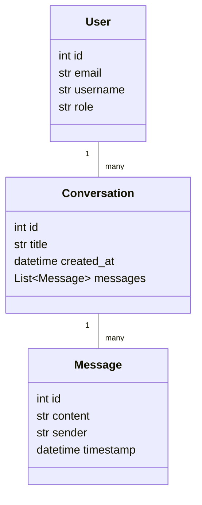
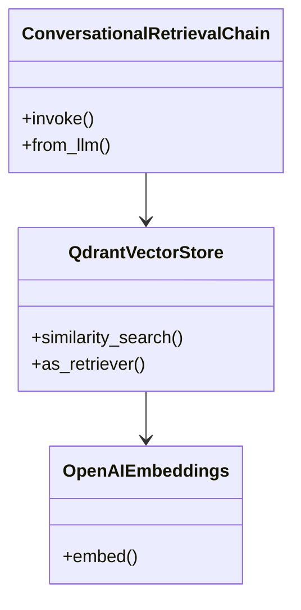
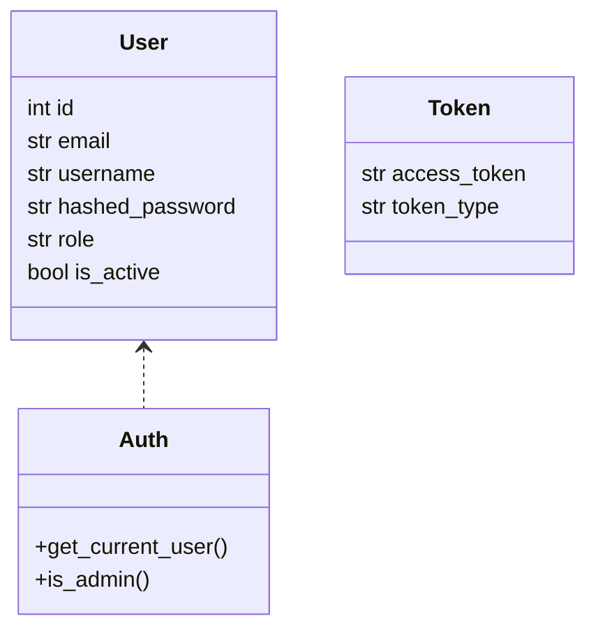
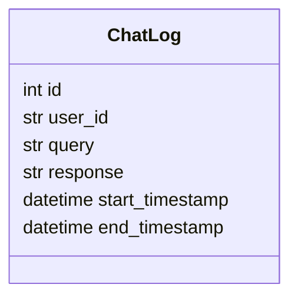
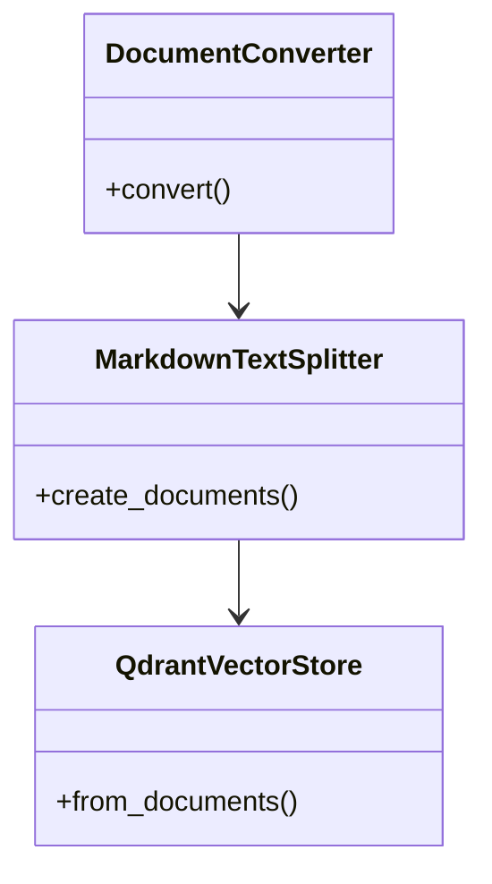

# Backend System Documentation

## 1. ภาพรวมระบบ (System Overview)
ระบบนี้เป็น Backend API สำหรับระบบแชท (Chatbot) ที่รองรับผู้ใช้หลายประเภท (ผู้ใช้ทั่วไป, guest, anonymous, admin) มีฟีเจอร์หลักดังนี้:
- ระบบแชท (Chat System)
- ระบบ RAG (Retrieval-Augmented Generation)
- ระบบจัดการผู้ใช้และการเข้าสู่ระบบ (Login System)
- ระบบจัดการไฟล์ PDF
- ระบบบันทึก log การใช้งาน (Logs System)
- ระบบประมวลผลเอกสาร (Docs Process)

---

## 2. สรุปฟีเจอร์และ Endpoint หลัก

### 2.1 ระบบแชท (Chat System)
- รองรับการสนทนาแบบ authenticated, guest, anonymous
- มี WebSocket สำหรับ real-time chat
- สามารถสร้าง conversation, ส่งข้อความ, รับข้อความตอบกลับจากบอท
- มี feedback สำหรับข้อความ

**Endpoints หลัก:**
- `/chat/conversations/` (GET, POST): สร้าง/ดึง conversation
- `/chat/conversations/{conversation_id}/messages/` (POST): ส่งข้อความใน conversation
- `/chat/guest/...` และ `/chat/anonymous/...`: สำหรับ guest/anonymous

---

### 2.2 ระบบ RAG (Retrieval-Augmented Generation)
- ใช้ LangChain, Qdrant, OpenAI ในการดึงข้อมูลและตอบคำถาม
- มีหลาย implementation (rag_system.py, new_rag.py, langgraph_rag_system.py)
- ใช้ vector store ในการค้นหา context

---

### 2.3 ระบบจัดการผู้ใช้และการเข้าสู่ระบบ (Login System)
- สมัครสมาชิก, ล็อกอิน, ล็อกเอาท์, refresh token
- JWT Authentication
- Role-based access (admin, user)
- CRUD ผู้ใช้ (admin เท่านั้น)

**Endpoints หลัก:**
- `/api/register` (POST): สมัครสมาชิก
- `/api/login` (POST): ล็อกอิน
- `/api/logout` (POST): ล็อกเอาท์
- `/api/refresh` (POST): refresh token
- `/admin/users/` (CRUD): จัดการผู้ใช้ (admin)

--- 

### 2.4 ระบบจัดการไฟล์ PDF
- อัปโหลด, ลบ, แสดงรายการ PDF (admin เท่านั้น)
- Endpoint: `/api/pdfs/`

---

### 2.5 ระบบบันทึก log การใช้งาน (Logs System)
- บันทึกการสนทนา (query, response, timestamp, user_id)
- ใช้ SQLAlchemy ORM

---

### 2.6 ระบบประมวลผลเอกสาร (Docs Process)
- แปลง PDF เป็น Markdown
- สร้าง embeddings และเก็บใน Qdrant vector DB

---

## 3. UML Class Diagram (แต่ละระบบ)

### 3.1 Chat System (ตัวอย่างบางส่วน)

- **หมายเหตุ:** ยังมี GuestConversation, AnonymousConversation, Feedback ฯลฯ

---

### 3.2 RAG System


---

### 3.3 Login System


---

### 3.4 Logs System


---

### 3.5 Docs Process


---

## 4. สรุปความสัมพันธ์และการไหลของข้อมูล

- ผู้ใช้ (User) สามารถเข้าสู่ระบบและรับ JWT Token
- ผู้ใช้สามารถสร้าง/เข้าร่วม conversation และส่งข้อความ
- ข้อความจะถูกส่งไปยัง RAG System เพื่อดึง context และตอบกลับ
- ทุกการสนทนาจะถูกบันทึก log
- Admin สามารถจัดการผู้ใช้และไฟล์ PDF ได้
- ระบบ Docs Process ใช้สำหรับเตรียมข้อมูล (PDF → Embedding) เพื่อใช้ใน RAG

---

## 5. เอกสารประกอบแต่ละฟีเจอร์ (รายละเอียด)
**(สามารถขยายแต่ละหัวข้อได้ตามต้องการ เช่น อธิบายแต่ละ endpoint, ตัวอย่าง request/response, flow diagram ฯลฯ)**

---

## 6. รายละเอียดเชิงลึกของ Endpoint (Request/Response, ตัวอย่าง, และ Flow)

### 6.1 Authentication & User Management

#### `/api/register` (POST)
- **Request:**
```json
{
  "email": "user@example.com",
  "username": "user1",
  "password": "password123",
  "role": "user"
}
```
- **Response:**
```json
{
  "id": 1,
  "email": "user@example.com",
  "username": "user1",
  "role": "user",
  "is_active": true
}
```

#### `/api/login` (POST)
- **Request:**
  - Content-Type: application/x-www-form-urlencoded
  - Body:
    - username: user1
    - password: password123
- **Response:**
```json
{
  "access_token": "...",
  "refresh_token": "...",
  "token_type": "bearer"
}
```

#### `/api/logout` (POST)
- **Request:**
  - Header: Authorization: Bearer <access_token>
- **Response:**
```json
{
  "message": "Logged out"
}
```

#### `/api/refresh` (POST)
- **Request:**
```json
{
  "refresh_token": "..."
}
```
- **Response:**
```json
{
  "access_token": "..."
}
```

#### `/admin/users/` (CRUD)
- **GET:**
  - Header: Authorization: Bearer <admin_token>
  - **Response:** รายชื่อผู้ใช้ทั้งหมด
- **POST:**
  - Header: Authorization: Bearer <admin_token>
  - **Request:** เช่นเดียวกับ /api/register
  - **Response:** ข้อมูลผู้ใช้ที่สร้างใหม่
- **PUT/DELETE/GET (by id):**
  - Header: Authorization: Bearer <admin_token>
  - **Response:** ข้อมูลผู้ใช้ที่ถูกแก้ไข/ลบ/ดู

---

### 6.2 PDF Management

#### `/api/pdfs/` (GET)
- **Request:**
  - Header: Authorization: Bearer <admin_token>
- **Response:**
```json
[
  "file1.pdf",
  "file2.pdf"
]
```

#### `/api/pdfs/upload/` (POST)
- **Request:**
  - Header: Authorization: Bearer <admin_token>
  - Content-Type: multipart/form-data
  - file: (PDF file)
- **Response:**
```json
{
  "message": "Successfully uploaded file1.pdf"
}
```

#### `/api/pdfs/{filename}` (DELETE)
- **Request:**
  - Header: Authorization: Bearer <admin_token>
- **Response:**
```json
{
  "message": "Successfully deleted file1.pdf"
}
```

---

### 6.3 Chat (Authenticated User)

#### `/chat/conversations/` (POST)
- **Request:**
```json
{
  "title": "My Conversation"
}
```
- **Response:**
```json
{
  "id": 1,
  "title": "My Conversation",
  "created_at": "2024-06-01T12:00:00Z",
  "messages": []
}
```

#### `/chat/conversations/{conversation_id}/messages/` (POST)
- **Request:**
```json
{
  "content": "สวัสดีครับ"
}
```
- **Response:**
```json
{
  "id": 10,
  "content": "สวัสดีครับ มีอะไรให้ช่วยไหมครับ?",
  "sender": "bot"
}
```

#### Flow (Authenticated Chat)
1. ผู้ใช้ login และรับ access_token
2. สร้าง conversation ใหม่ (POST /chat/conversations/)
3. ส่งข้อความใน conversation (POST /chat/conversations/{id}/messages/)
4. รับข้อความตอบกลับจากบอท
5. สามารถดู/แก้ไข/ลบ conversation ได้

---

### 6.4 Chat (Guest User)

#### `/chat/guest/message` (POST)
- **Request:**
```json
{
  "content": "สอบถามข้อมูล"
}
```
- **Response:**
```json
{
  "message": "นี่คือคำตอบจากบอท...",
  "machine_id": "..."
}
```

#### `/chat/guest/conversations` (POST)
- **Request:**
```json
{
  "title": "Guest Chat"
}
```
- **Response:**
```json
{
  "id": "...",
  "title": "Guest Chat",
  "created_at": "...",
  "updated_at": "...",
  "messages": []
}
```

#### Flow (Guest Chat)
1. ผู้ใช้ guest ขอ machine_id (POST /chat/guest/machine-id)
2. สร้าง conversation (POST /chat/guest/conversations)
3. ส่งข้อความ (POST /chat/guest/conversations/{id}/messages)
4. รับ bot ตอบกลับ

---

### 6.5 Chat (Anonymous User)

#### `/chat/anonymous/message` (POST)
- **Request:**
```json
{
  "content": "สอบถามข้อมูล"
}
```
- **Response:**
```json
{
  "message": "นี่คือคำตอบจากบอท..."
}
```

#### Flow (Anonymous Chat)
1. สร้าง anonymous conversation (POST /chat/anonymous/conversations)
2. ส่งข้อความ (POST /chat/anonymous/conversations/{id}/messages)
3. รับ bot ตอบกลับ

---

### 6.6 Feedback

#### `/chat/feedback/` (POST)
- **Request:**
```json
{
  "message_id": 10,
  "score": 5,
  "comment": "ดีมากครับ"
}
```
- **Response:**
```json
{
  "id": 1,
  "message_id": 10,
  "score": 5,
  "comment": "ดีมากครับ"
}
```

---