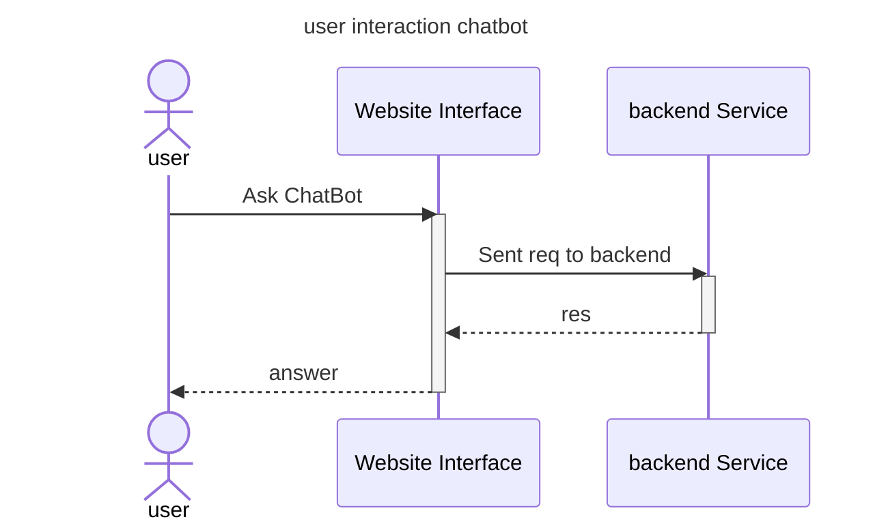
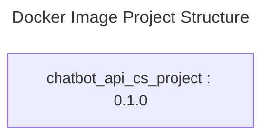

# Chatbot API

## 🔍Overview  
- This project focuses on developing a back-end API using Python 3 and Fast API, while integrating Langchain to leverage the RAG (Retrieval-Augmented Generation) model. The RAG model is either hosted on OpenAI or open-sourced LLM, each with LLama3, to create a chatbot API.

## 🔑Key Features
  - Back End API: Fastapi
  - LangChain: creat app with LLM
  - OpenAI API 
  - Local LLM (Ollama) 

## 🔚 API end Point 
  - `/api/`: Root endpoint to welcome users to the chatbot API.  
  - `/api/chat`: API for chatbot interaction. Receives user query and responds with chatbot-generated answer.
  - `/api/chat_streaming`:chat bot streaming 
  - `/api/history`: get char history  
  - `/api/clear-history`:  clear chat history.
  
## Structure project
### 🚩 Sequence diagram

### Project Structure

## Verstion 
- 0.1.0 initial  chatbot API