# การวิเคราะห์ระบบ LannaFinChat ด้วย Activity Diagrams

## ภาพรวม (Overview)

เอกสารนี้เป็นการวิเคราะห์ระบบ LannaFinChat โดยใช้ Activity Diagrams เพื่อแสดงลำดับการทำงานและขั้นตอนการประมวลผลของแต่ละระบบย่อย โดยเน้นการแสดง flow การทำงานที่ชัดเจนและเข้าใจง่าย

## 🏗️ สถาปัตยกรรมระบบ (System Architecture)

### ระบบหลัก (Core Systems)

1. **Frontend Web Application** - React + TypeScript + Tailwind CSS
2. **Backend API Services** - FastAPI + Python
3. **Vector Database** - Qdrant
4. **Relational Database** - PostgreSQL
5. **AI Service** - OpenAI GPT-4o-mini
6. **File Storage** - Local File System

---

## 🔐 ระบบ Authentication (Authentication System)

### Activity Diagram: User Login Flow

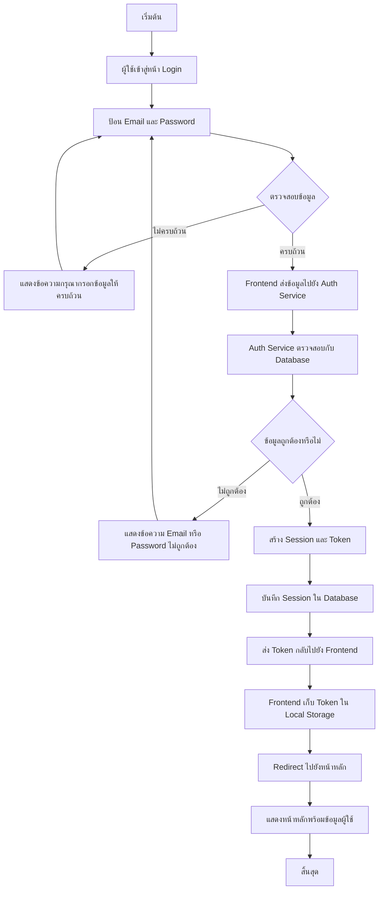

### Activity Diagram: Guest Mode Activation

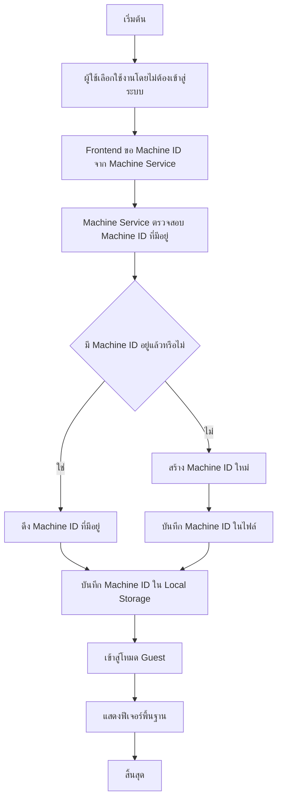

---

## 💬 ระบบแชต (Chat System)

### Activity Diagram: Send Message & Receive Response

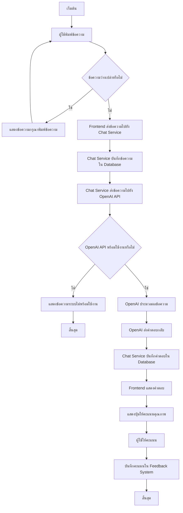

### Activity Diagram: Conversation Management

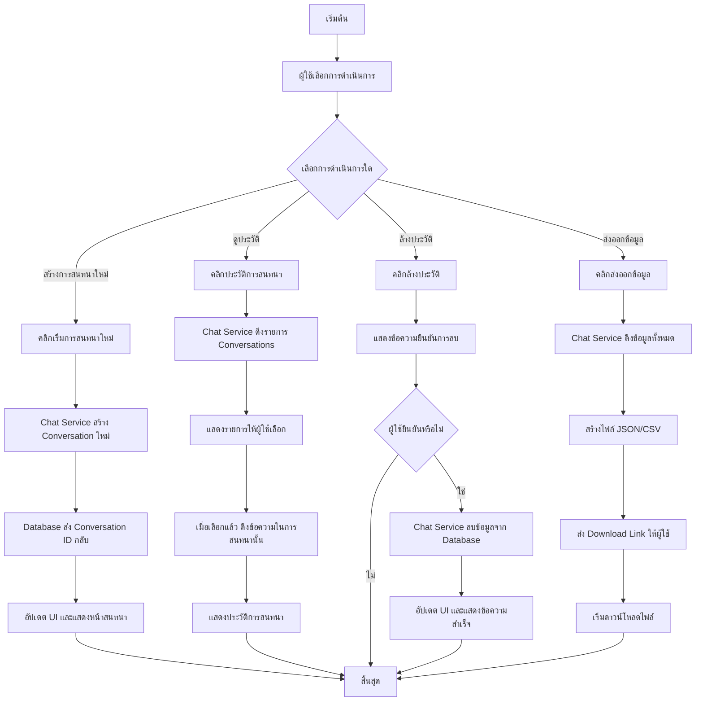

---

## 📄 ระบบจัดการเอกสาร (Document Management System)

### Activity Diagram: PDF Upload & Processing

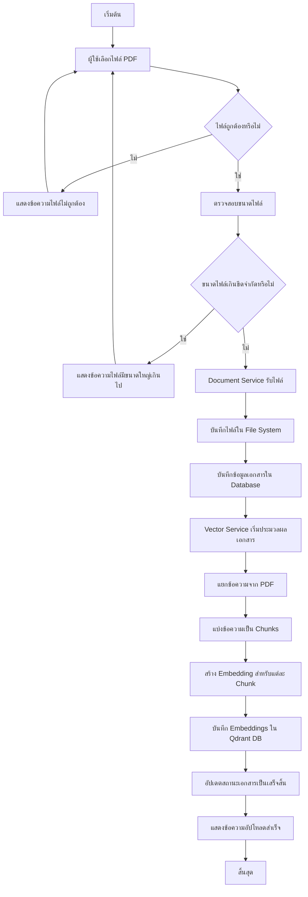

### Activity Diagram: Document Search & Retrieval

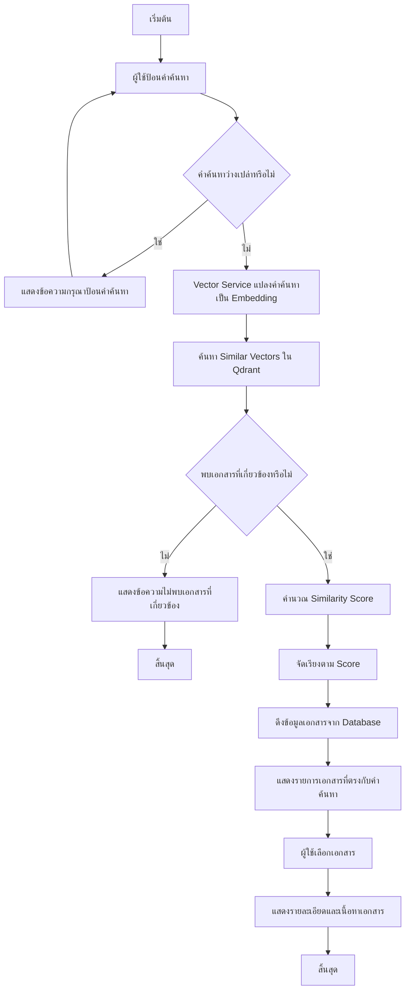

### Activity Diagram: Document Deletion

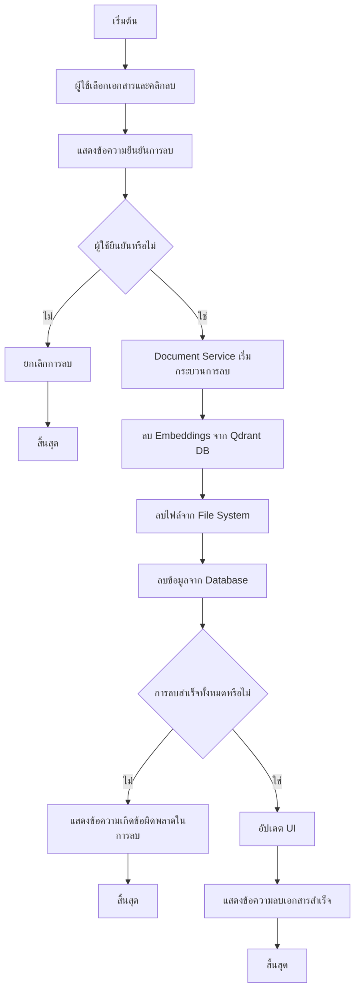

---

## ⚙️ ระบบจัดการระบบ (System Management)

### Activity Diagram: User Management

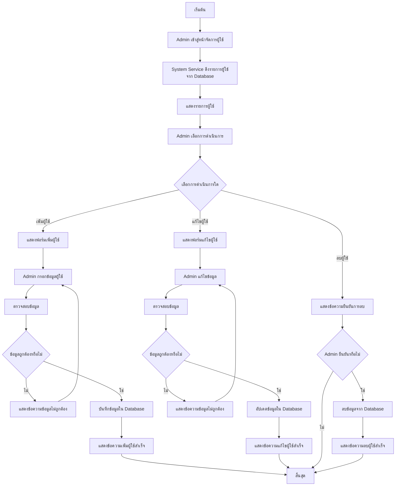

### Activity Diagram: System Backup & Restore

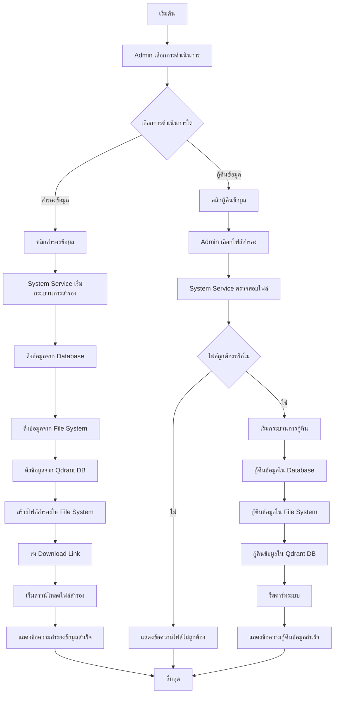

---

## 🖥️ ระบบจัดการเครื่อง (Machine Management)

### Activity Diagram: Machine ID Generation & Management

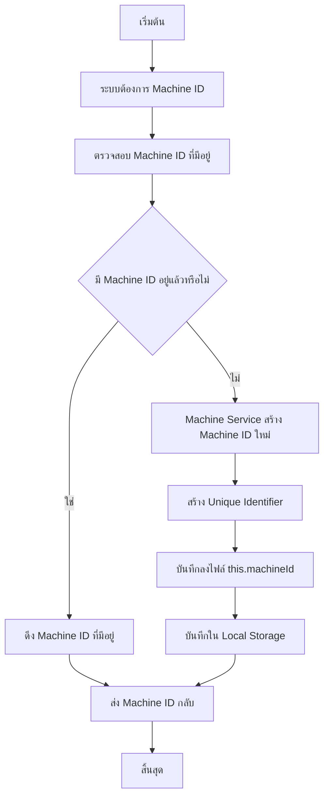

### Activity Diagram: Machine Data Export/Import

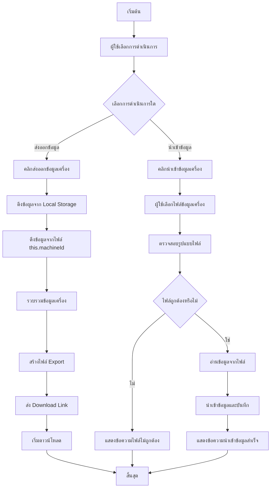

---

## 📝 ระบบข้อเสนอแนะ (Feedback System)

### Activity Diagram: Response Rating & Feedback

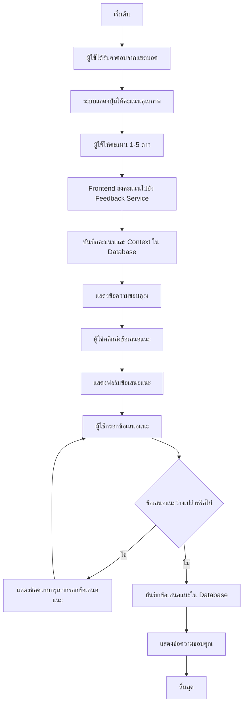

### Activity Diagram: Feedback Analytics

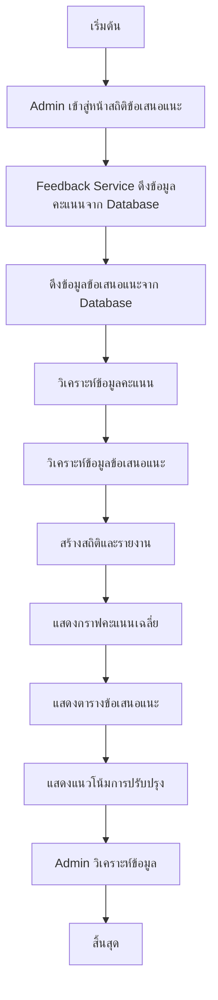

---

## 🗄️ ระบบฐานข้อมูลเวกเตอร์ (Vector Database System)

### Activity Diagram: Vector Collection Management

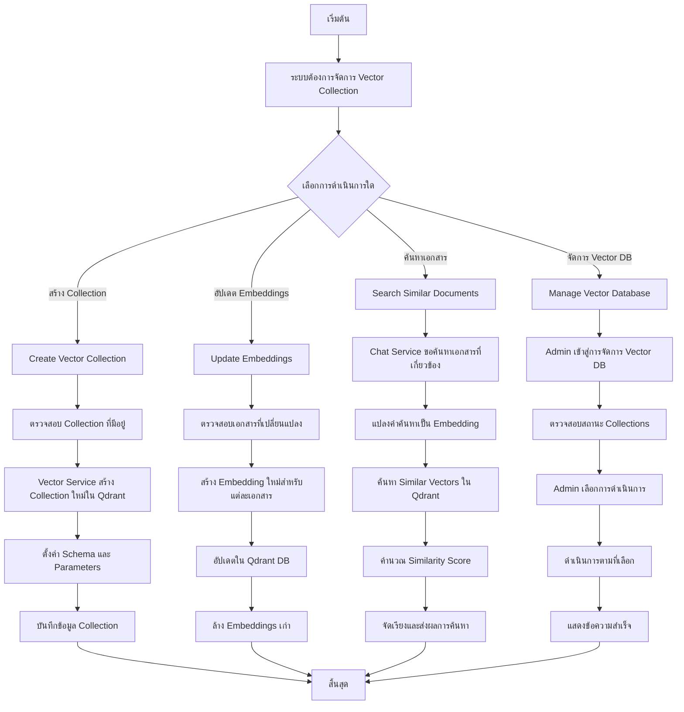

---

## 🔄 การทำงานร่วมกันของระบบ (System Integration)

### Activity Diagram: End-to-End Chat Flow

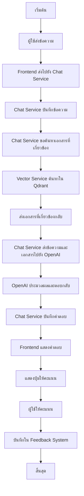

---

## 🎯 จุดสำคัญของแต่ละระบบ

### 🔐 Authentication System
- **Session Management**: จัดการ session และ token อย่างปลอดภัย
- **Guest Mode**: สร้าง Machine ID เพื่อแยกแยะผู้ใช้แต่ละเครื่อง
- **Error Handling**: จัดการข้อผิดพลาดการเข้าสู่ระบบอย่างเหมาะสม

### 💬 Chat System
- **AI Integration**: เชื่อมต่อกับ OpenAI API อย่างมีประสิทธิภาพ
- **Data Persistence**: บันทึกข้อมูลการสนทนาอย่างสมบูรณ์
- **User Experience**: แสดงสถานะการทำงานและข้อความยืนยัน

### 📄 Document Management System
- **Multi-step Processing**: การอัปโหลดและประมวลผลเอกสารหลายขั้นตอน
- **Vector Processing**: สร้าง embeddings สำหรับการค้นหา
- **File Management**: จัดการไฟล์และฐานข้อมูลอย่างสอดคล้อง

### ⚙️ System Management
- **Admin Operations**: การจัดการระบบโดยผู้ดูแลระบบ
- **Backup/Restore**: การสำรองและกู้คืนข้อมูลอย่างปลอดภัย
- **Monitoring**: การติดตามประสิทธิภาพระบบ

### 🖥️ Machine Management
- **Local Storage**: จัดการข้อมูลใน browser และไฟล์
- **Unique Identification**: สร้างและจัดการ Machine ID
- **Data Portability**: การนำเข้าและส่งออกข้อมูล

### 📝 Feedback System
- **Quality Assessment**: การให้คะแนนและรับข้อเสนอแนะ
- **Analytics**: การวิเคราะห์และสร้างสถิติ
- **Continuous Improvement**: ลูปการปรับปรุงระบบ

### 🗄️ Vector Database System
- **Vector Operations**: การจัดการ vector embeddings
- **Similarity Search**: การค้นหาความคล้ายกัน
- **Performance Optimization**: การ optimize ประสิทธิภาพ

---

## 📊 ลักษณะการทำงานของระบบ

### 🔄 แบบ Synchronous
- การเข้าสู่ระบบ (Login)
- การอัปโหลดเอกสาร
- การค้นหาข้อมูล
- การจัดการผู้ใช้

### ⚡ แบบ Asynchronous
- การประมวลผล embeddings
- การสำรองข้อมูล
- การส่งอีเมลยืนยัน
- การประมวลผลเอกสาร

### 🔁 แบบ Batch Processing
- การอัปเดต embeddings
- การส่งออกข้อมูล
- การวิเคราะห์สถิติ
- การสำรองข้อมูล

---

## 🎯 ข้อสังเกตสำคัญ

1. **Error Handling**: ทุกระบบมีขั้นตอนการจัดการข้อผิดพลาดอย่างชัดเจน
2. **Data Consistency**: การลบข้อมูลจะดำเนินการในหลายระบบอย่างสอดคล้อง
3. **User Experience**: มีการแสดงข้อความยืนยันและสถานะการทำงาน
4. **Security**: การตรวจสอบสิทธิ์และการล้างข้อมูลอย่างเหมาะสม
5. **Scalability**: การแยกส่วนประกอบทำให้ระบบสามารถขยายได้
6. **Monitoring**: มีการติดตามและบันทึกการทำงานของระบบ
7. **Backup & Recovery**: ระบบรองรับการสำรองและกู้คืนข้อมูล

---

*เอกสารนี้แสดงการวิเคราะห์ระบบ LannaFinChat ในรูปแบบ Activity Diagrams เพื่อให้เข้าใจลำดับการทำงานและขั้นตอนการประมวลผลของแต่ละระบบย่อยอย่างชัดเจน*
