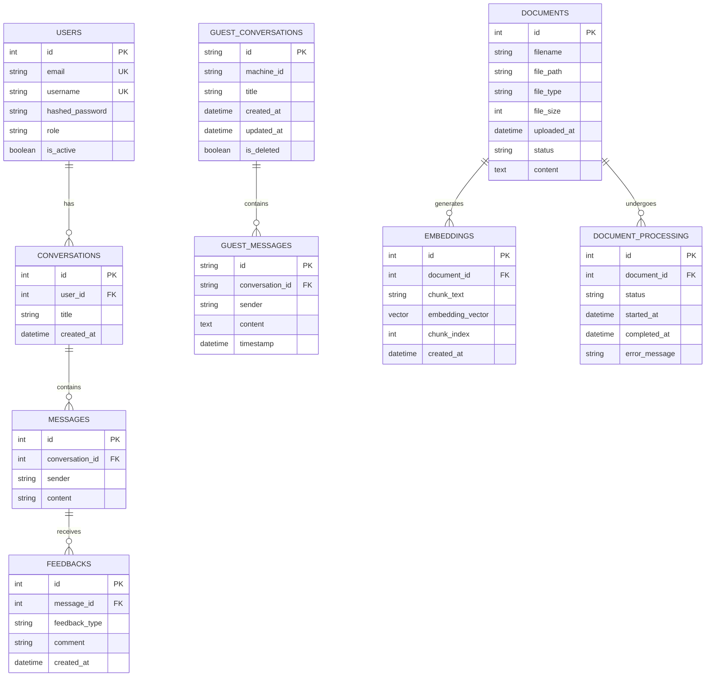
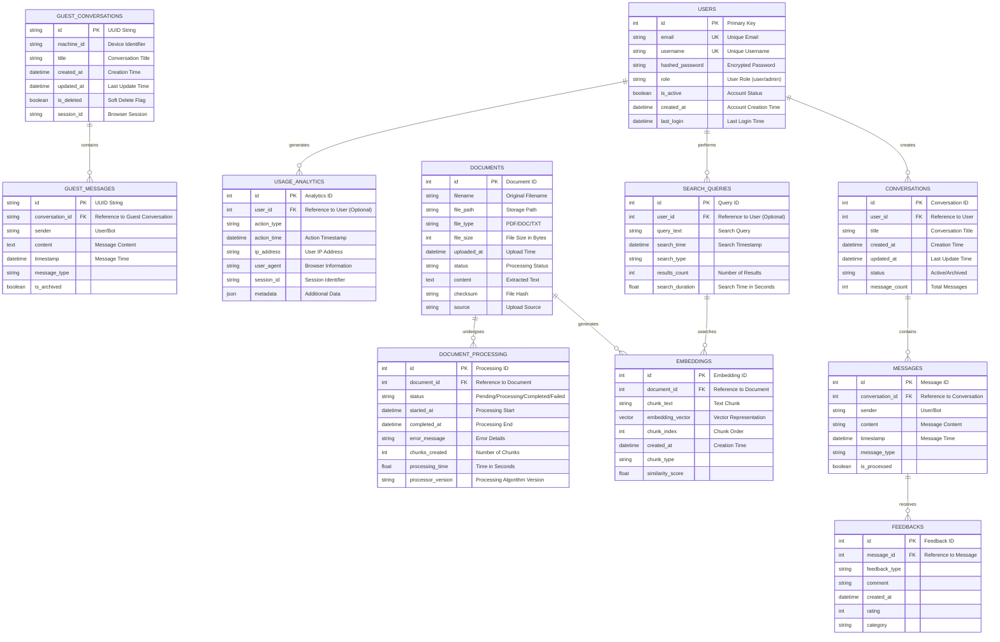

# Entity-Relationship (E-R) Diagram สำหรับระบบ LannaFinChat

## ภาพรวมระบบ
ระบบ LannaFinChat เป็นระบบแชตบอตอัจฉริยะสำหรับตอบคำถามจากเอกสาร โดยใช้เทคนิค RAG (Retrieval Augmented Generation) และ LLM (Large Language Models)

## E-R Diagram หลัก

## E-R Diagram แบบขยาย (Extended Version)

## คำอธิบายเอนทิตี้หลัก

### 1. **USERS** - ระบบผู้ใช้
- เก็บข้อมูลผู้ใช้ที่ลงทะเบียนในระบบ
- รองรับการกำหนดบทบาท (user/admin)
- มีระบบการยืนยันตัวตนด้วย email และ username

### 2. **CONVERSATIONS** - การสนทนา
- เก็บประวัติการสนทนาของผู้ใช้แต่ละคน
- แต่ละการสนทนามีข้อความหลายข้อความ
- รองรับการตั้งชื่อการสนทนา

### 3. **MESSAGES** - ข้อความ
- เก็บข้อความในแต่ละการสนทนา
- แยกประเภทผู้ส่ง (user/bot)
- รองรับการประมวลผลด้วย RAG

### 4. **FEEDBACKS** - ข้อเสนอแนะ
- เก็บความคิดเห็นของผู้ใช้ต่อข้อความของบอต
- รองรับการให้คะแนนและความคิดเห็น
- ใช้ในการปรับปรุงระบบ

### 5. **GUEST_CONVERSATIONS** - การสนทนาผู้เยี่ยมชม
- รองรับผู้ใช้ที่ไม่ลงทะเบียน
- แยกข้อมูลตามเครื่อง (machine_id)
- มีระบบ soft delete

### 6. **DOCUMENTS** - เอกสาร
- เก็บข้อมูลเอกสารที่อัปโหลด
- รองรับหลายรูปแบบไฟล์
- มีสถานะการประมวลผล

### 7. **EMBEDDINGS** - เวกเตอร์เอกสาร
- เก็บเวกเตอร์ที่ได้จากการประมวลผลเอกสาร
- แบ่งเอกสารเป็นชิ้นเล็กๆ (chunks)
- ใช้ในการค้นหาข้อมูลที่เกี่ยวข้อง

### 8. **DOCUMENT_PROCESSING** - การประมวลผลเอกสาร
- ติดตามสถานะการประมวลผลเอกสาร
- เก็บข้อมูลเวลาและข้อผิดพลาด
- รองรับการประมวลผลแบบ batch

## ความสัมพันธ์หลัก

1. **One-to-Many**: ผู้ใช้หนึ่งคนสามารถมีหลายการสนทนา
2. **One-to-Many**: การสนทนาหนึ่งครั้งมีหลายข้อความ
3. **One-to-Many**: ข้อความหนึ่งข้อความมีหลายข้อเสนอแนะ
4. **One-to-Many**: เอกสารหนึ่งฉบับสร้างหลาย embeddings
5. **One-to-One**: เอกสารหนึ่งฉบับมีหนึ่งการประมวลผล

## ระบบฐานข้อมูลที่ใช้

- **PostgreSQL**: สำหรับข้อมูลผู้ใช้ การสนทนา และข้อความ
- **Qdrant**: สำหรับเก็บ embeddings และการค้นหาเวกเตอร์
- **File System**: สำหรับเก็บไฟล์เอกสาร

## การออกแบบฐานข้อมูล

### หลักการออกแบบ
1. **Normalization**: ลดการซ้ำซ้อนของข้อมูล
2. **Referential Integrity**: ใช้ Foreign Key เพื่อรักษาความถูกต้อง
3. **Indexing**: สร้าง index สำหรับฟิลด์ที่ใช้ค้นหาบ่อย
4. **Soft Delete**: รองรับการลบข้อมูลแบบ soft delete
5. **Audit Trail**: เก็บประวัติการเปลี่ยนแปลงข้อมูล

### การปรับปรุงประสิทธิภาพ
1. **Connection Pooling**: จัดการการเชื่อมต่อฐานข้อมูล
2. **Caching**: ใช้ Redis สำหรับข้อมูลที่เข้าถึงบ่อย
3. **Partitioning**: แบ่งตารางตามช่วงเวลา
4. **Archiving**: ย้ายข้อมูลเก่าไปยังตารางแยก
