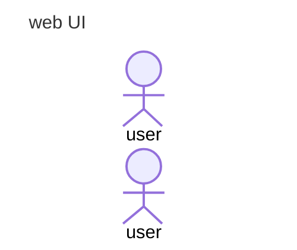

# Chatbot WebUI

## Overview

A modern web-based chatbot interface built with React and TypeScript, featuring real-time chat functionality, PDF document management, and integration with Azure OpenAI services.

## Technology Stack

### Frontend Framework & Build Tools
- **React** 18.3.1 - UI library
- **TypeScript** 5.5.3 - Type-safe JavaScript
- **Vite** 6.3.2 - Next-generation build tool
- **React Router** 6.30.1 - Client-side routing

### Styling & UI Components
- **Tailwind CSS** 3.4.11 - Utility-first CSS framework
- **Material-UI (MUI)** 6.1.1 - Component library
- **Emotion** 11.13.x - CSS-in-JS styling

### HTTP & Data Management
- **Axios** 1.10.0 - HTTP client
- **JWT Decode** 4.0.0 - JWT token decoding

### Development Tools
- **ESLint** 9.9.0 - Code linting
- **Prettier** 3.3.3 - Code formatting
- **PostCSS** 8.4.45 - CSS processing
- **Autoprefixer** 10.4.20 - CSS vendor prefixing

## Configuration

### Environment Setup

Copy the example environment file and configure your settings:

```sh
cp .env.example .env
```

### Environment Variables

```sh
# Azure OpenAI Configuration
AZURE_OPENAI_ENDPOINT=<your-azure-openai-endpoint>
AZURE_OPENAI_API_KEY=<your-azure-openai-api-key>

# Backend API
VITE_HOST=<your-backend-api-url>

# Version Information
WEB_GUI=0.6.0
CHATBOT_API=0.5.22
PDF_MANAGEMENT_API=0.5.19
```

## Getting Started

### Installation

```sh
npm install
```

### Development Server

```sh
npm run dev
```

Starts the development server with hot module reloading.

### Production Build

```sh
npm run build
```

Generates an optimized production build.

### Preview Production Build

```sh
npm run preview --port 8000
```

### Additional Commands

- **Linting**: `npm run lint` - Run ESLint to check code quality
- **Formatting**: `npm run format` - Format code with Prettier
- **Docker Build**: `npm run docker:build` - Build Docker image
- **Docker Push**: `npm run docker:push` - Push Docker image to registry

## Features

- **Chat Interface** (`/`) - Real-time chat with Azure OpenAI integration
- **PDF Management** (`/management`) - Create, Read, Update, and Delete PDF documents
- **PDF List** (`/pdflist`) - View and browse uploaded PDF documents
- **About** (`/about`) - Application information and documentation

## Sequence Diagram


```mermaid
---
title : web UI
---
sequenceDiagram
      actor user


```
