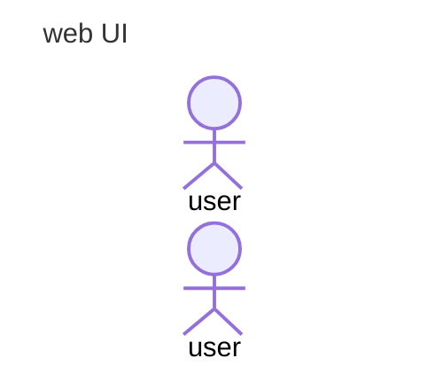

# Chatbot WebUI

## Overview

- this project chat Web-baseUI build with reactTS

## Configurethe `.env`

```sh
cp .env.example  .env
```

`.env`

```sh
# The base URL for your Azure OpenAI resource.
AZURE_OPENAI_ENDPOINT=<You_API_ENDPOINT>

# The API key for your Azure OpenAI resource.
AZURE_OPENAI_API_KEY=<YOU_API_KEY>

# HOST
VITE_HOST=<YOU_BACKEND_API>

#VERSTION
#Ops
WEB_GUI=0.5.25
CHATBOT_API=0.5.22
PDF_MANAGEMENT_API=0.5.19
```

## Run Project

- install

```sh
npm install
```

- run dev project

```sh
npm run dev
```

- build project

```sh
npm run build
```

## Features

- `/` chatbot
- `pdflist` listpdf
- `management` CURD PDF
- `about` about chatbot

## Sequence Diagram


